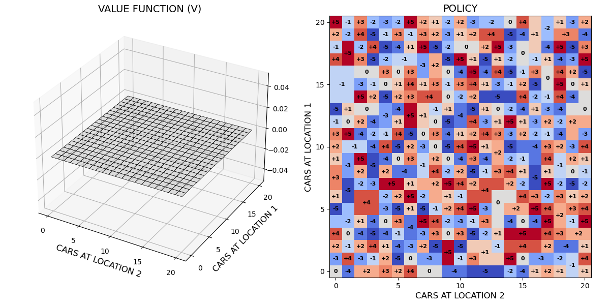
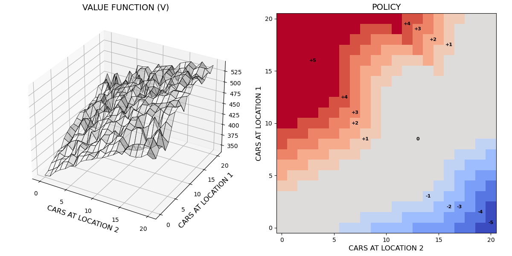
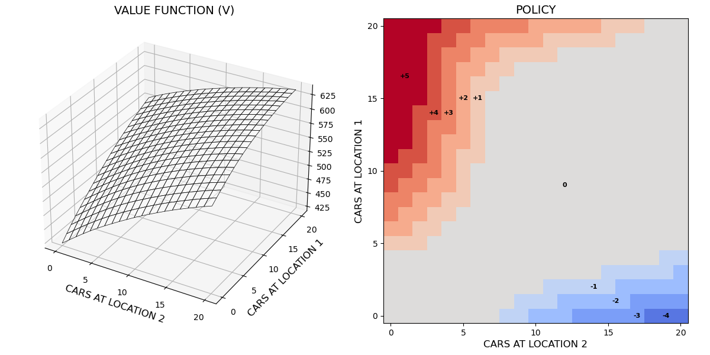

# CUDA implementations of policy iteration algorithm for Jack's Car Rental (JCR)
The repository constitutes a part of research on CUDA computational approaches for algorithms based on 
*contraction mapping theorem* due to Banach (a.k.a. the fixed-point theorem).

JCR, devised by Sutton and Barto (2020), is a classic problem of finding the optimal policy for 
a fully known MDP (Markov Decision Process), i.e., given its joint-probability distribution.
In this research, the *policy iteration* method has been applied, and the repository contains
four CUDA implementations of policy iteration (and two referential CPU-based implementation) for the JCR problem.

<table>
  <tr width="100%">
    <td width="32%">$V_0$, $\pi_0$</td>
    <td width="32%">$\xrightarrow{\textrm{E}}V_1\approx v_{\pi_0}\xrightarrow{\textrm{I}}\pi_1$</td>
    <td width="4%">AA</td>
    <td>$\xrightarrow{\textrm{E}} V_k \approx v_{\pi_{k-1}}\xrightarrow{\textrm{I}}\pi_k$</td>
  </tr>
  <tr width="100%">
    <td width="32%"></td>
    <td width="32%"></td>
    <td width="4%">$\cdots$</td>
    <td width="32%"></td>
  </tr>
</table>

## Acknowledgments and credits
- [Numba](https://numba.pydata.org): a high-performance just-in-time Python compiler.
