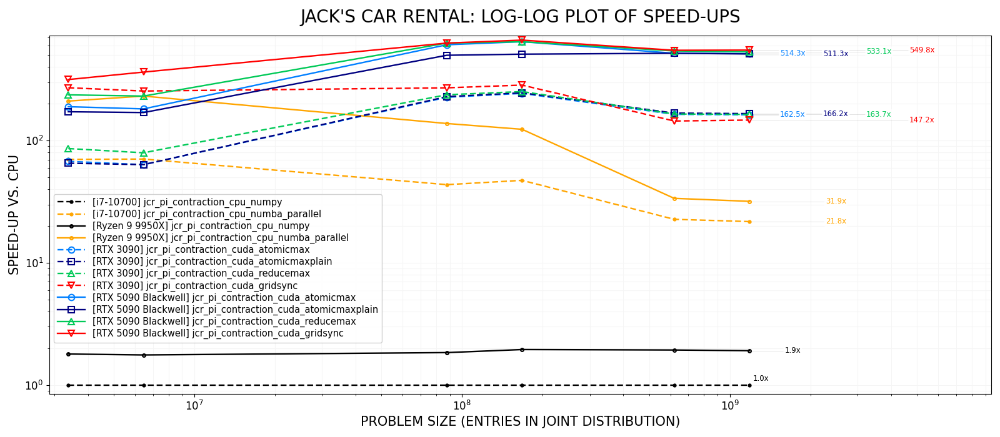

# CUDA-based policy iteration for Jack's Car Rental (JCR)
The repository constitutes a part of research on CUDA computational approaches for algorithms based on 
*contraction mapping theorem* due to Banach, a.k.a. the fixed-point theorem.

JCR, devised by Sutton and Barto (1998, 2020), is a classic problem of finding the optimal policy for 
a fully known MDP (Markov Decision Process), i.e., given its joint-probability distribution.
In this research, the *policy iteration* method has been applied, and the repository contains
four CUDA implementations of policy iteration for the JCR problem (and two referential CPU-based implementations).

<table>
  <tr>
    <td>$V_0, \pi_0\quad$  </td>
    <td>$\xrightarrow{\textrm{E}}V_1\approx v_{\pi_0}\xrightarrow{\textrm{I}}\pi_1\quad$ </td>
    <td>$\cdots$ </td>
    <td>$\xrightarrow{\textrm{E}}V_4\approx v_{\pi_3}\xrightarrow{\textrm{I}}\pi_4=\pi^*\quad$ </td>
  </tr>
</table>

Implementations of CUDA kernels have been carried out using *Numba* - a just-in-time compiler for Python.
Numba exposes a programming interface closely mirroring the native CUDA C++ API, and translates kernel functions
into its internal representation (Numba IR), which is then lowered via the LLVM and NVVM-based pipeline into PTX and finally 
JIT-compiled into executable machine code.

# Problem statement and settings
We consider several sizes of the JCR problem, but in its original setting (Sutton and Barto; 1998, 2020), JCR is defined as follows. 
Jack manages two locations for a nationwide car rental company. 
Each day, the number of clients requesting cars at each location and the number of cars returned follow Poisson distributions 
$P(k;\lambda)=\lambda^k e^{-\lambda} / k!$, defined by parameters $\lambda_{1,\textrm{req}}=3, \lambda_{1,\textrm{ret}}=2$ 
and $\lambda_{2,\textrm{req}}=4, \lambda_{2,\textrm{ret}}=2$,
respectively for locations $1$ and $2$. Each location can store up to $N=20$ cars (any cars returned when the lot
is full are redirected elsewhere). Jack is allowed to move cars overnight between the locations, at most $M=5$.
For every car rented, Jack earns a \$10 profit, whereas moving a car costs \$2.
This problem can be modeled as a finite MDP, where the state is the number of cars at each location at the end of the day,
with the goal to find the best policy (strategy) for Jack.

Given the $N, M$ constants, the number of distinct states in the MDP for JCR is $(N+1)^2$ and the number
of distinct actions is $2M + 1$. The set of actions is $\{-M, \ldots, 0, \ldots, M\}$,
where positive numbers represent cars moved from location $1$ to $2$,
and negative ones the reverse direction. The number
of distinct stochastic rewards is $2N + 1$, implied by the possible totals of rental requests
at both locations: $\{0, 1, \ldots, 2N\}$. Cars that Jack decides to move, by taking a specific
action, incur a deterministic cost, which can be treated as a constant negative offset to the stochastic rewards
and thus factored out from the joint distribution $P(r,s'|s,a)$. Hence, 
the number of entries in the distribution $P$ is: $(2N+1)\cdot(N+1)^2\cdot(N+1)^2\cdot(2M + 1)$, and this number defines
the problem size.

In CUDA approaches, we assume that $P$ has been properly precomputed and placed in the device memory
as a four-dimensional array `dev_P[:, :, :, :]`, and available to kernels. 
The efficient order of indexes (for frequent coalesced reads) is `dev_P[s, a, r', s']`.

# Speed-ups

# Selected experimental results (averages over 10 repetitions)
| no. | approach (design)                               | eval. iters. | $d_\infty$ (eps: 10-4) | mean time [s] | Speed-ups    | mean time [s] | Speed-ups    |
|:----|:------------------------------------------------|:------------:|:------------------------------------:|--------------:|-------------:|--------------:|-------------:|
|     |                                                 |              |                                      | **(RTX 3090)**| **(RTX 3090)**| **(RTX 5090)**| **(RTX 5090)**|
|     | **problem size: ~3.4 $\cdot$ 106**   ($N$=10, $M$=5; shape: 121 $\times$ 11 $\times$ 21 $\times$ 121, entries: 3 382 071)      |||||||
| 1   | `jcr_pi_contraction_cpu_numpy`                  | 326          | 6.1 $\cdot$ 10-5          | 1.894         | $\times$ 1.0 | 1.054         | $\times$ 1.8 |
| 2   | `jcr_pi_contraction_cpu_numba_parallel`         | 326          | 6.1 $\cdot$ 10-5          | 0.028         | $\times$ 67.6| 0.009         | $\times$ 210.4|
| 3   | `jcr_pi_contraction_cuda_atomicmax`             | 325          | 6.1 $\cdot$ 10-5          | 0.028         | $\times$ 67.6| 0.010         | $\times$ 189.4|
| 4   | `jcr_pi_contraction_cuda_atomicmaxplain`        | 325          | 6.1 $\cdot$ 10-5          | 0.029         | $\times$ 65.3| 0.011         | $\times$ 172.2|
| 5   | `jcr_pi_contraction_cuda_reducemax`             | 325          | 6.1 $\cdot$ 10-5          | 0.022         | $\times$ 86.1| 0.008         | $\times$ 236.7|
| 6   | `jcr_pi_contraction_cuda_gridsync`              | 321          | 6.1 $\cdot$ 10-5          | 0.007         | $\times$ 270.6| 0.006        | $\times$ 315.7|
|     | **problem size: ~6.5 $\cdot$ 106**   ($N$=10, $M$=10; shape: 121 $\times$ 21 $\times$ 21 $\times$ 121, entries: 6 456 681)    |||||||
| 7   | `jcr_pi_contraction_cpu_numpy`                  | 401, 408     | 9.2 $\cdot$ 10-5          | 2.544         | $\times$ 1.0 | 1.441         | $\times$ 1.8 |
| 8   | `jcr_pi_contraction_cpu_numba_parallel`         | 401, 408     | 9.2 $\cdot$ 10-5          | 0.036         | $\times$ 70.7| 0.011         | $\times$ 231.3|
| 9   | `jcr_pi_contraction_cuda_atomicmax`             | 435          | 6.1 $\cdot$ 10-5          | 0.040         | $\times$ 63.6| 0.014         | $\times$ 181.7|
| 10  | `jcr_pi_contraction_cuda_atomicmaxplain`        | 435          | 6.1 $\cdot$ 10-5          | 0.040         | $\times$ 63.6| 0.015         | $\times$ 169.6|
| 11  | `jcr_pi_contraction_cuda_reducemax`             | 435          | 6.1 $\cdot$ 10-5          | 0.032         | $\times$ 79.5| 0.011         | $\times$ 231.3|
| 12  | `jcr_pi_contraction_cuda_gridsync`              | 411          | 6.1 $\cdot$ 10-5          | 0.010         | $\times$ 254.4| 0.007        | $\times$ 363.4|
|     | **problem size: ~8.8 $\cdot$ 107**   ($N$=20, $M$=5; shape: 441 $\times$ 11 $\times$ 41 $\times$ 441, entries: 87 710 931)     |||||||
| 13  | `jcr_pi_contraction_cpu_numpy`                  | 414, 420     | 6.1 $\cdot$ 10-5          | 19.454        | $\times$ 1.0 | 10.541        | $\times$ 1.8 |
| 14  | `jcr_pi_contraction_cpu_numba_parallel`         | 414, 420     | 6.1 $\cdot$ 10-5          | 0.446         | $\times$ 43.6| 0.141         | $\times$ 138.0|
| 15  | `jcr_pi_contraction_cuda_atomicmax`             | 410          | 6.1 $\cdot$ 10-5          | 0.086         | $\times$ 226.2| 0.032        | $\times$ 607.9|
| 16  | `jcr_pi_contraction_cuda_atomicmaxplain`        | 410          | 6.1 $\cdot$ 10-5          | 0.085         | $\times$ 228.9| 0.039        | $\times$ 498.8|
| 17  | `jcr_pi_contraction_cuda_reducemax`             | 410          | 6.1 $\cdot$ 10-5          | 0.082         | $\times$ 237.2| 0.031        | $\times$ 627.5|
| 18  | `jcr_pi_contraction_cuda_gridsync`              | 394          | 6.1 $\cdot$ 10-5          | 0.072         | $\times$ 270.2| 0.031        | $\times$ 627.5|
|     | **problem size: ~1.7 $\cdot$ 108**   ($N$=20, $M$=10; shape: 441 $\times$ 21 $\times$ 41 $\times$ 441, entries: 167 448 141)   |||||||
| 19  | `jcr_pi_contraction_cpu_numpy`                  | 413, 406     | 6.1 $\cdot$ 10-5          | 21.900        | $\times$ 1.0 | 11.207        | $\times$ 2.0 |
| 20  | `jcr_pi_contraction_cpu_numba_parallel`         | 413, 406     | 6.1 $\cdot$ 10-5          | 0.463         | $\times$ 47.3| 0.177         | $\times$ 123.7|
| 21  | `jcr_pi_contraction_cuda_atomicmax`             | 400          | 6.1 $\cdot$ 10-5          | 0.090         | $\times$ 243.3| 0.034        | $\times$ 644.1|
| 22  | `jcr_pi_contraction_cuda_atomicmaxplain`        | 400          | 6.1 $\cdot$ 10-5          | 0.089         | $\times$ 246.1| 0.043        | $\times$ 509.3|
| 23  | `jcr_pi_contraction_cuda_reducemax`             | 400          | 6.1 $\cdot$ 10-5          | 0.087         | $\times$ 251.7| 0.034        | $\times$ 644.1|
| 24  | `jcr_pi_contraction_cuda_gridsync`              | 385          | 6.1 $\cdot$ 10-5          | 0.077         | $\times$ 284.4| 0.033        | $\times$ 663.6|
|     | **problem size: ~6.2 $\cdot$ 108**   ($N$=30, $M$=5; shape: 961 $\times$ 11 $\times$ 61 $\times$ 961, entries: 619 682 591)    |||||||
| 25  | `jcr_pi_contraction_cpu_numpy`                  | 457, 453     | 6.1 $\cdot$ 10-5          | 85.480        | $\times$ 1.0 | 44.117        | $\times$ 1.9 |
| 26  | `jcr_pi_contraction_cpu_numba_parallel`         | 457, 453     | 6.1 $\cdot$ 10-5          | 3.764         | $\times$ 22.7| 2.536         | $\times$ 33.7 |
| 27  | `jcr_pi_contraction_cuda_atomicmax`             | 440          | 6.1 $\cdot$ 10-5          | 0.521         | $\times$ 164.1| 0.165        | $\times$ 518.1|
| 28  | `jcr_pi_contraction_cuda_atomicmaxplain`        | 440          | 6.1 $\cdot$ 10-5          | 0.509         | $\times$ 167.9| 0.165        | $\times$ 518.1|
| 29  | `jcr_pi_contraction_cuda_reducemax`             | 440          | 6.1 $\cdot$ 10-5          | 0.518         | $\times$ 165.0| 0.158        | $\times$ 541.0|
| 30  | `jcr_pi_contraction_cuda_gridsync`              | 424          | 6.1 $\cdot$ 10-5          | 0.591         | $\times$ 144.6| 0.156        | $\times$ 557.9|
|     | **problem size: ~1.2 $\cdot$ 109**   ($N$=30, $M$=10; shape: 961 $\times$ 21 $\times$ 61 $\times$ 961, entries: 1 183 030 401) |||||||
| 31  | `jcr_pi_contraction_cpu_numpy`                  | 427, 442     | 6.1 $\cdot$ 10-5          | 87.424        | $\times$ 1.0 | 45.692        | $\times$ 1.9 |
| 32  | `jcr_pi_contraction_cpu_numba_parallel`         | 427, 442     | 6.1 $\cdot$ 10-5          | 4.017         | $\times$ 21.8| 2.744         | $\times$ 31.9 |
| 33  | `jcr_pi_contraction_cuda_atomicmax`             | 430          | 0.0 $\cdot$ 10-5          | 0.538         | $\times$ 162.5| 0.170        | $\times$ 514.3|
| 34  | `jcr_pi_contraction_cuda_atomicmaxplain`        | 430          | 0.0 $\cdot$ 10-5          | 0.526         | $\times$ 166.2| 0.171        | $\times$ 511.3|
| 35  | `jcr_pi_contraction_cuda_reducemax`             | 430          | 0.0 $\cdot$ 10-5          | 0.534         | $\times$ 163.7| 0.164        | $\times$ 533.1|
| 36  | `jcr_pi_contraction_cuda_gridsync`              | 406          | 6.1 $\cdot$ 10-5          | 0.594         | $\times$ 147.2| 0.159        | $\times$ 549.8|

# Usage for default settings
TODO

# Usage for larger settings
TODO

# Acknowledgements
- [Numba](https://numba.pydata.org): a high-performance just-in-time Python compiler.
- Richard S. Sutton and Andrew G. Barto. 1998. *Reinforcement Learning: An Introduction*. MIT Press, Cambridge, MA, USA.
- Richard S. Sutton and Andrew G. Barto. 2020. *Reinforcement Learning: An Introduction* (2nd ed.). MIT Press, Cambridge, MA, USA.
